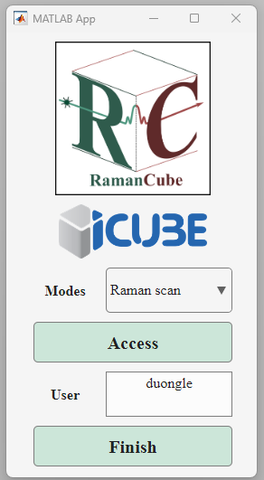
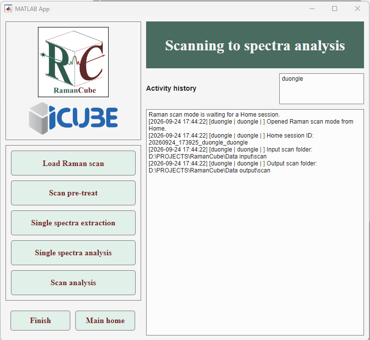
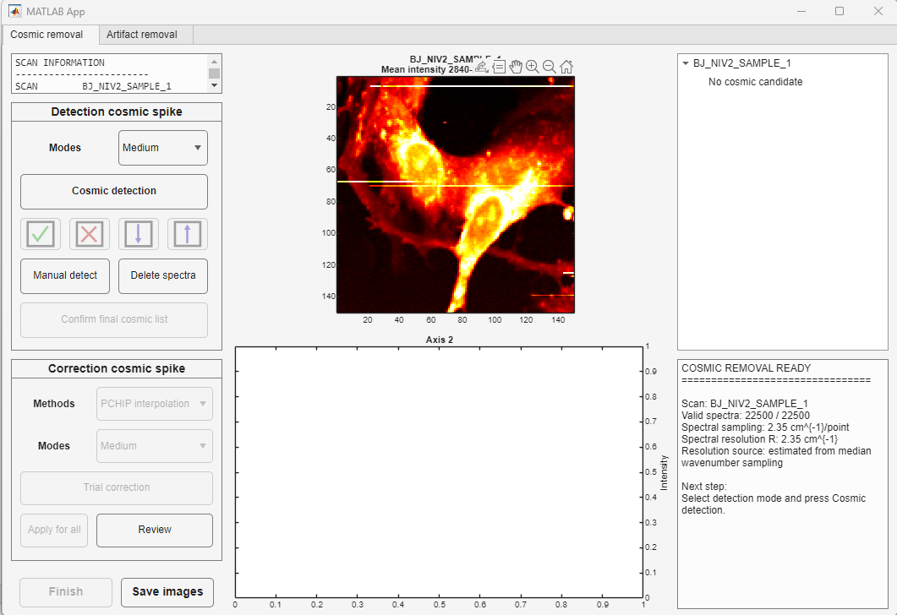
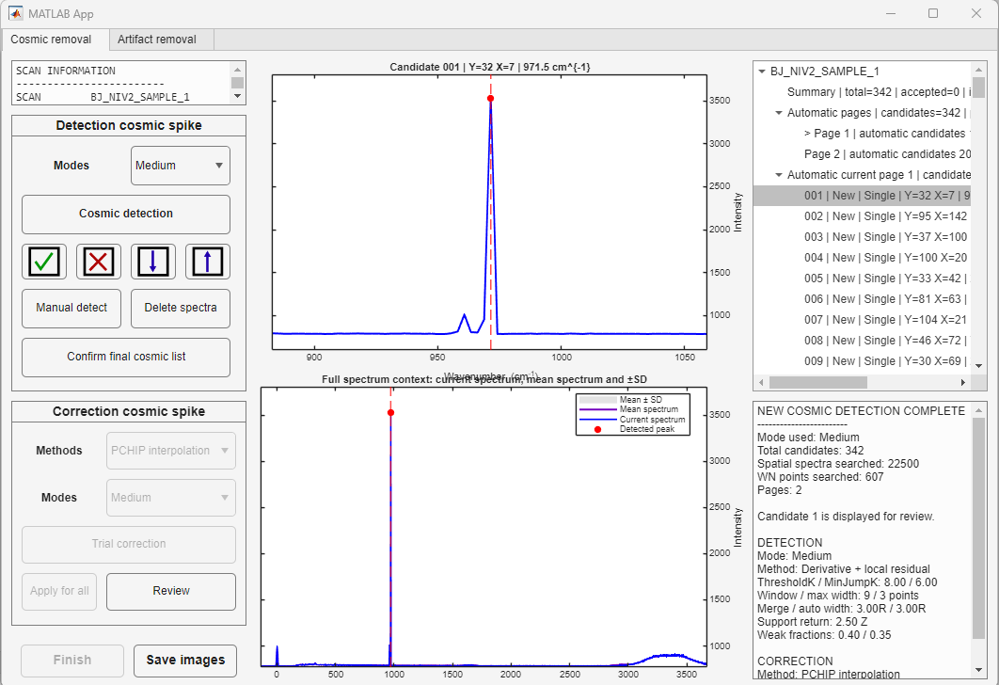
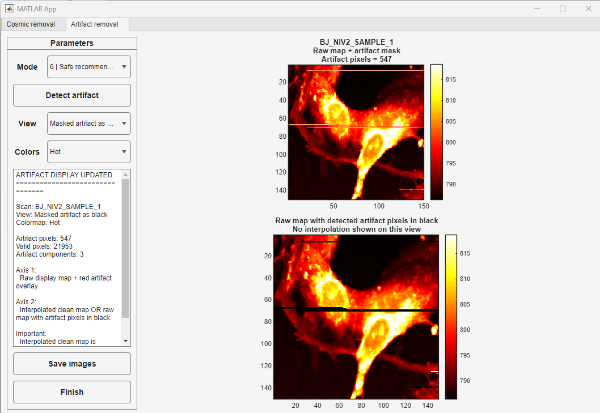
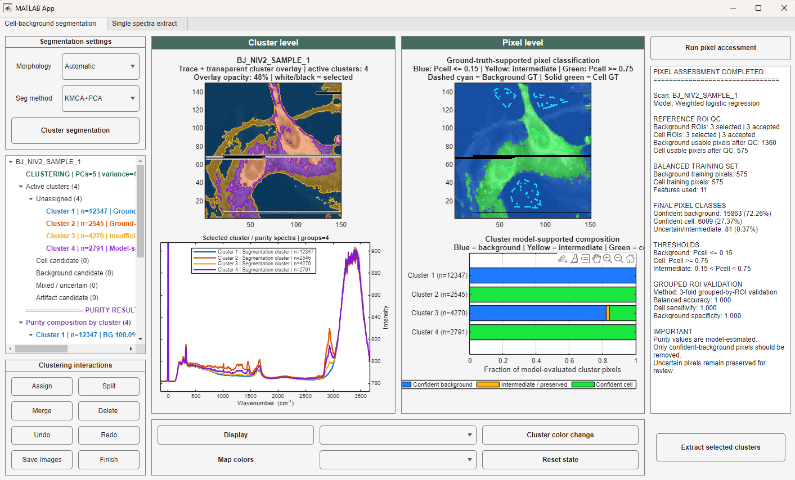
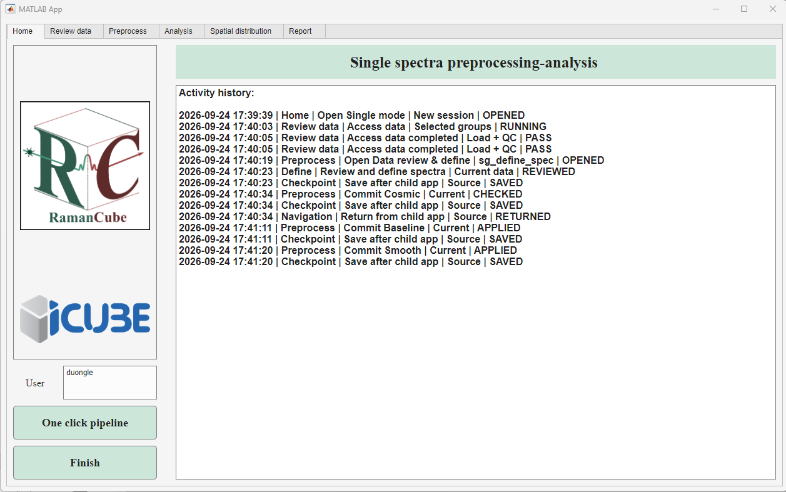
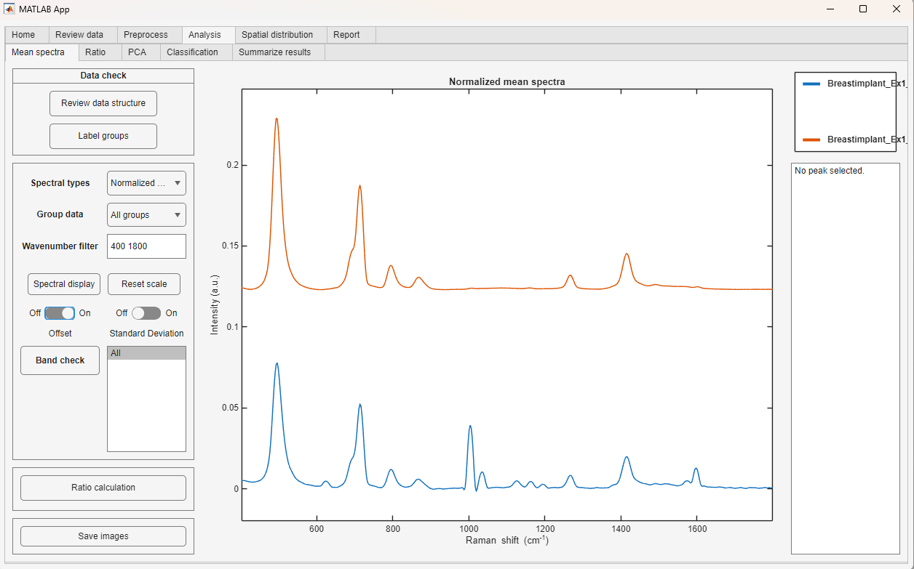
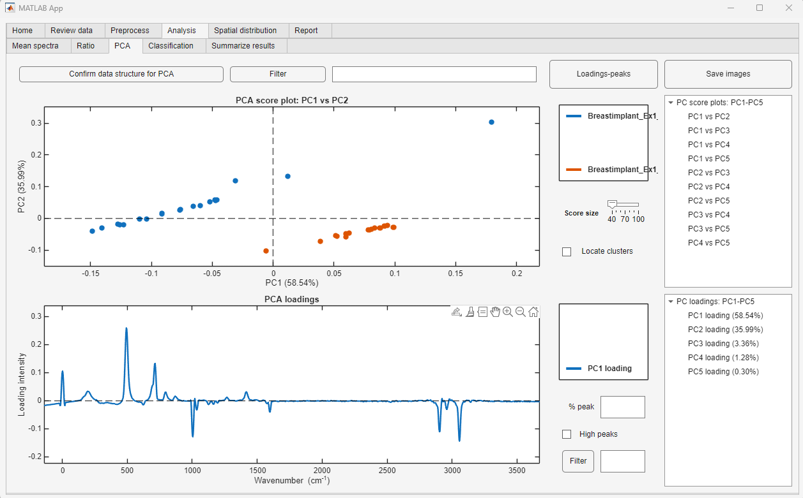

1. RamanCube introduction

RamanCube is a MATLAB App Designer application for Raman spectral processing, visualization, and comparison.

It was developed to support analysis of biological Raman datasets with multiple experimental groups.

2. Features

- Load and organize Raman spectra
- Baseline correction
- Visualize individual and mean spectra
- Select Raman peaks interactively
- Define exact peak positions and search windows
- Extract peak position, intensity, area, and FWHM
- Compare Raman features between groups

3. Requirements

- MATLAB
- MATLAB App Designer

4. Usage

Open the project folder in MATLAB and run the main `.mlapp` file.

Keep the supporting `.m` files and image resources in the same project directory.

5. Notes

Raman bands in biological samples often contain overlapping contributions from multiple molecular components. Peak assignments should therefore be interpreted with reference to the original spectra and supporting literature.

6. Interface

## Interface

### Home

  

### Raman scan workflow

  
  
  

  
  

### Single-spectrum analysis

  
  
  

7. Author

Duong LE
